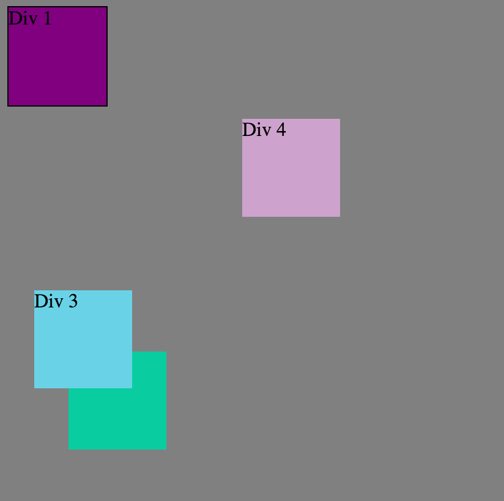

###How can you use Chrome's DevTools inspector to help you format or position elements?
- With Chrome DevTools inspector, you can look at the html or css of the site. Then, you can make changes on it and see what the changes are, which allows you to play around with the formatting or positioning or elements. The changes are not saved to the actual site.

###How can you resize elements on the DOM using CSS?
- We used a lot of percentages to resize the height and width of elements using CSS. This helped when it came to centering elements or making elements a specific size in proportion to the browser page.

###What are the differences between absolute, fixed, static, and relative positioning? Which did you find easiest to use? Which was most difficult?
- Static is the default positioning all elements start with. Relative positioning allows for the positioning of an element based on where it would normally be. Absolute positioning lets the user remove the element from the flow of the page and place it wherever they want to. Fixed positioning makes elements stay on the same part of the screen relative to the browser window, so scrolling does not affect it. I found fixed pretty self-explanatory and easy to use, while relative and absolute were a little more confusing.

###What are the differences between margin, border, and padding?
- Each of the three touches on different parts of an element. Padding is the innermost layer surrounding the content. Border is the edge of the element in between margin and padding. Margin is the space around the element. Each has their uses for how you want the elements in a page to look.

###What was your impression of this challenge overall? (love, hate, and why?)
- I thought it was fun. My pair and I enjoyed playing around with the positioning and it was definitely more fun working on the challenge with someone else. I realized that I probably should have taken screenshots of my entire screen with the browser instead of cropping out just our image...hopefully that's not too big a deal.

